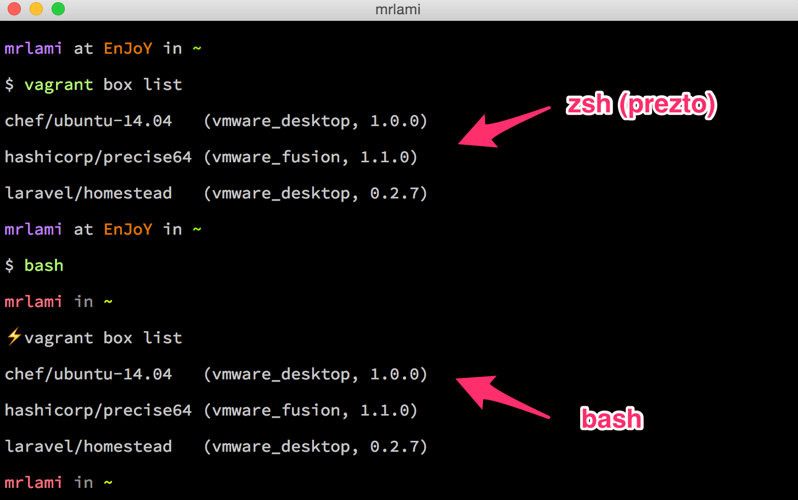

These are scripts I use to setup my mac after a clean install (which I like to do quite often).  They borrow heavily from barryclark/bashstrap, andrew8088/dotfiles, and kevinSuttle/dotfiles.

### Features
- Customized ***bash***
    - Colored file listing 'ls'
    - Syntax highlighted 'cat'
    - Faster directory navigation with z.sh
    - Customized bash prompt line (with Git branch status, and customizable symbol ⚡)
- Customized ***zsh*** with [prezto](https://github.com/sorin-ionescu/prezto)
- ```clean_mac_setup()``` function ***(NOTE: xcode command-line tools needed)***
	- Installs Homebrew and Cask
	- Installs misc hombrew apps (ack, tmux, git, node, php 5.6, etc.)
	- Installs misc cask apps (chrome, sublime text, vagrant, virtualbox, etc.)
	- Installs other tools like (iojs, gulp, composer, tmuxifier, etc.)

### Installation: dotfiles

1. Back up your current dotfiles (optional):

		mv ~/.bash_profile ~/.bash_profile_backup
		mv ~/.bashrc ~/.bashrc_backup
		mv ~/.zshrc ~/.zshrc_backup
		mv ~/.gitconfig ~/.gitconfig_backup
		mv ~/.gitignore ~/.gitignore_backup

2. Clone to your home directory:

		git clone https://github.com/mrlami/dotFiles.git ~/_bin

	**NOTE: *You must clone to ~/bin***

3. Run install script:

		source ~/_bin/install.sh


##### iTerm Setup (10 mins)



Following these steps will make your iTerm look identical to mine in the screenshot above.

1. setup [cmd + left] to skip word left: *iTerm Preferences > Keys > Global Shortcut Keys > change [cmd + left] action to [esc + b]
2. setup [cmd + right] to skip word righ: *iTerm Preferences > Keys > Global Shortcut Keys > change [cmd + right] action to [esc + f]
3. Turn off long tab titles: *iTerm Preferences > Appearance > Windows & Tab Titles > uncheck them all*
4. Unbold font: *iTerm Preferences > Profiles > Default > Text > Text Rendering > uncheck "Draw bold text in bold font"*
5. Lighter blue for the directory highlighting: *iTerm Preferences > Profiles > Default > Colors > Load Presets > Pastel (Dark Background)

### Installation: Fresh Mac Setup
Run ```clean_mac_setup``` from command-line.

**-OR-**

Run individual install commands

    # homebrew & cask
    install_brew_and_cask
    install_default_brew_apps
    install_default_cask_apps

    # pygments, prezto, tmuxifier, etc.
    install_pygments
    install_prezto
    install_tmuxifier
    install_hushlogin

    # dev language apps
    install_node_apps
    install_php_apps

    # others
    #install_vagrant_plugins
    #setup_dropbox_app_backups
    #setup_mac_defaults

####Default Homebrew Installs
- [brew.sh](https://github.com/mrlami/dotFiles/blob/master/installs/brew.sh)

####Default Cask Installs
- [cask.sh](https://github.com/mrlami/dotFiles/blob/master/installs/cask.sh)

####Prezto Steeef Theme Setting (pet peeve)
- In file below, join line 89 with 88 to prevent additional space on top of terminal with steeef theme
  ~/.zprezto/modules/prompt/functions/prompt_steeef_setup
