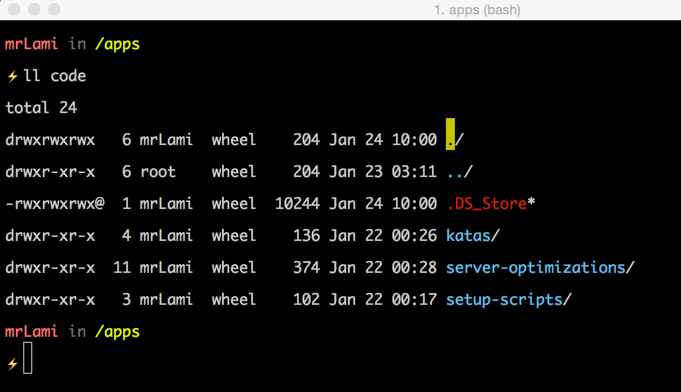

dotFiles
=========

Scripts I use to setup my mac terminal (& complete system) when I wipe it clean which happens quite often.  It borrows from barryclark/bashstrap, andrew8088/dotfiles, and kevinSuttle/dotfiles.

### Features
- Customized ***bash***
    - Colored file listing 'ls'
    - Syntax highlighted 'cat'
    - Faster directory navigation with z.sh
    - Customized bash prompt line (with Git branch status, and customizable symbol ⚡)
- Customized ***zsh*** with [prezto](https://github.com/sorin-ionescu/prezto)
- ```init_mac_settings()``` function to set misc mac settings - e.g. timezone
- ```clean_mac_setup()``` function ***(NOTE: xcode & xcode command-line needed)***
	- Installs Homebrew and Cask
	- Installs misc hombrew apps (ack, tmux, git, node, php 5.6, etc.)
	- Installs misc cask apps (chrome, sublime text, vagrant, virtualbox, etc.)
	- Installs misc node apps (bower, gulp)
	- Installs PHP composer
	- Installs Tmuxifier
	- Installs hushlogin
	- Calls *init_mac_settings()*

### Installation: dotfiles

1. Back up your current dotfiles (optional):

		mv ~/.bash_profile ~/.bash_profile_backup
		mv ~/.bashrc ~/.bashrc_backup
		mv ~/.gitconfig ~/.zshrc_backup
		mv ~/.gitconfig ~/.vimrc_backup
		mv ~/.gitconfig ~/.gitconfig_backup

2. Clone to your home directory:

		git clone https://github.com/mrlami/dotFiles.git ~/_bin

	**NOTE: *You must clone to ~/bin***

3. Run install script:

		source ~/_bin/install.sh


##### iTerm Setup (10 mins)



Following these steps will make your iTerm look identical to mine in the screenshot above.

1. setup [cmd + left] to skip word left: *iTerm Preferences > Keys > Global Shortcut Keys > change [cmd + left] action to [esc + b]
2. setup [cmd + right] to skip word righ: *iTerm Preferences > Keys > Global Shortcut Keys > change [cmd + right] action to [esc + f]
3. Turn off long tab titles: *iTerm Preferences > Appearance > Windows & Tab Titles > uncheck them all*
4. Prettier font: *iTerm Preferences > Profiles > Default > Text > Regular Font & Non-ASCII > 15pt Monaco*
5. Unbold font: *iTerm Preferences > Profiles > Default > Text > Text Rendering > uncheck "Draw bold text in bold font"*
6. Lighter blue for the directory highlighting: *iTerm Preferences > Profiles > Default > Colors > click Blue and make it lighter*
7. Make default window size bigger: *iTerm Preferences > Profiles > Default > Window > Setting for New Windows > I like Columns: 105, Rows 18*

### Installation: Fresh Mac Setup
Run ```clean_mac_setup``` from command-line.

**-OR-**

Run individual install commands

    # homebrew & cask
    install_homebrew_and_cask
    install_default_homebrew_apps
    install_default_cask_apps

    # npm, composer, tmuxifier, etc.
    install_default_npm_apps
    install_php_composer
    install_tmuxifier
    install_hushlogin
    install_pygments

    #initialize mac settings
    init_mac_settings

####Default Homebrew Installs
- ack
- gawk
- tmux
- tree
- wget
- ngrok
- git
- node
- redis
- php56
- php56-pdo-pgsql
- php56-mcrypt
- phpunit
- codeception

####Default NPM Installs
- bower
- gulp

####Default Cask Installs
**Utilities**

- bartender
- caffeine
- moom
- coconutbattery
- wallpaper-wizard
- xtrafinder
- alfred
- iterm2
- keka
- namechanger
- snagit
- camtasia

**Media**

- 4k-video-downloader
- handbrake
- vlc

**Messaging**

- hipchat
- slack
- screenhero

**Cloud/Internet**

- bittorrent-sync
- dropbox
- google-drive
- yandexdisk
- google-chrome
- transmission

**DevOps**

- vmware-fusion
- virtualbox
- vagrant
- cornerstone
- navicat-premium
- pgadmin3
- tower
- transmit

**Development**

- sublime-text-3
- kaleidoscope
- codekit
- sketch
- phpstorm
- appcode
- xamarin-studio

**Others** *(un-comment lines from cask.sh to install these)*

- gitbook
- microsoft-office
- thinkorswim
- cinch
- sizeup
- cocktail
- totalfinder
- postbox
- utorrent

- xquartz inkscape
